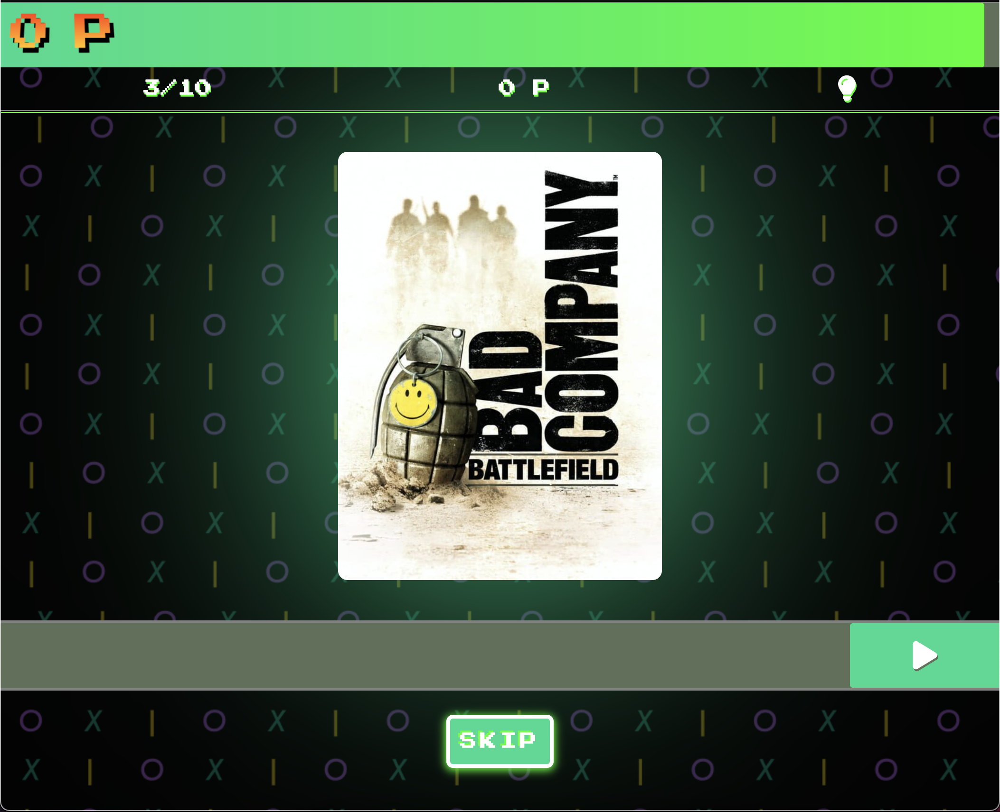

<div align="center">

  
  <h1>The Name Of The Game</h1>
  
  <p>
    Guess the title of the blurred game cover and collect points. If you're stuck, use the lightbulb in the upper corner and get a hint!
  </p>
   
<h4>
    <a href="https://the-name-of-the-game.vercel.app/">Play the game</a>
  <span> · </span>
    <a href="https://github.com/nidorbRotkiv/The-Name-Of-The-Game/issues/">Report Bug</a>
  </h4>
</div>

<br />

<!-- Table of Contents -->
# :notebook_with_decorative_cover: Table of Contents

- [About the Project](#star2-about-the-project)
  * [Screenshots](#camera-screenshots)
  * [Tech Stack](#space_invader-tech-stack)
  * [Environment Variables](#key-environment-variables)
- [Getting Started](#toolbox-getting-started)
  * [Prerequisites](#bangbang-prerequisites)
  * [Setup](#Setup)
- [Usage](#eyes-usage)

  

<!-- About the Project -->
## :star2: About the Project


<!-- Screenshots -->
### :camera: Screenshot

<div align="center"> 
 
</div>


<!-- TechStack -->
### :space_invader: Tech Stack


 <ul>
    <li><a href="https://www.javascript.com/">JavaScript</a></li>
    <li><a href="https://nuxtjs.org/">Nuxt.js</a></li>
    <li><a href="https://vuejs.org/">Vue.js</a></li>
    <li><a href="https://nodejs.org/">Node.js</a></li>
    <li><a href="https://supabase.com/">Supabase</a></li>
  </ul>


<!-- Env Variables -->
### :key: Environment Variables

To run this project, you will need to add the following environment variables to your .env file

`IGDB_CLIENT_ID`

`IGDB_AUTHORIZATION`

`PUBLIC_SUPABASE_URL`

`PUBLIC_SUPABASE_ANON_KEY`

<!-- Getting Started -->
## 	:toolbox: Getting Started

<!-- Prerequisites -->
### :bangbang: Prerequisites

 <ul>
   <li><a href="https://api-docs.igdb.com/">API key from IGDB</a></li>
   <li><a href="https://supabase.com/">Key from Supabase</a></li>
 </ul>

### Setup

Clone the project

```bash
  git clone https://github.com/nidorbRotkiv/The-Name-Of-The-Game.git
```

npm commands

```bash
# install dependencies
$ npm install

# serve with hot reload at localhost:3000
$ npm run dev

# build for production and launch server
$ npm run build
$ npm run start

# generate static project
$ npm run generate
```

For detailed explanation on how things work, check out the [documentation](https://nuxtjs.org).


<!-- Usage -->
## :eyes: Usage

* The Name Of The Game is about guessing the title of the blurred cover image as fast as possible. 
* The image will get less blurry with time, which also means that the player will receive less points. 
* The player can choose to use a hint by clicking on the lightbulb in the top right corner of the screen. This will take away 2 points from the player's score. 
 
* Abbreviations of the title are considered when a guess is submitted as well as different translations of the title in some cases. 
* Misspelling a title will still give the player full points.
